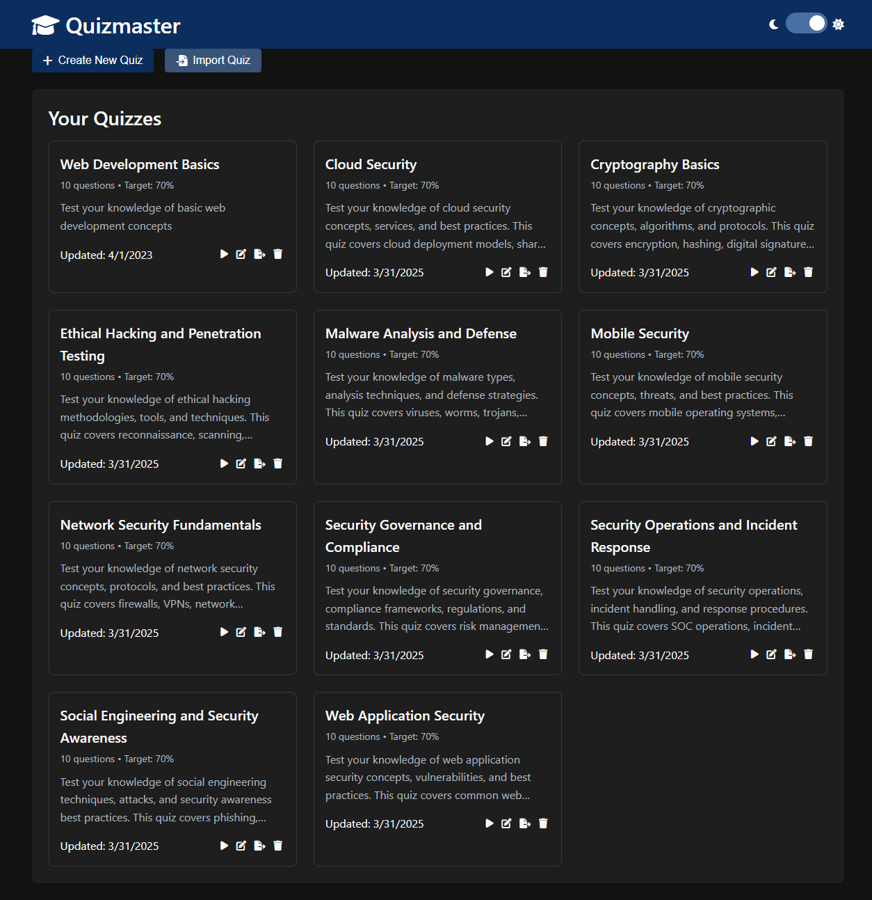

# Quizmaster

Quizmaster is a self-hosted web application that allows users to create, manage, and take quizzes. It's lightweight and doesn't rely on a traditional database, instead storing quizzes in JSON format for easy export and import.



## Features

- **Quiz Creation and Management**
  - Create quizzes with multiple-choice and true/false questions
  - Add unlimited answer options for multiple-choice questions
  - Include images in questions for visual content
  - Set targets based on number of correct questions or percentage
  - Add references to answers for educational purposes
  - Clickable URLs in questions and references
  - Support for multiple correct answers

- **Quiz Taking**
  - Randomized questions and answers for each attempt
  - Progress tracking during quiz taking
  - Detailed results with correct/incorrect answers
  - Option to review answers with references
  - Visual questions with images for enhanced learning

- **Import/Export**
  - Export quizzes as JSON files
  - Import quizzes directly from your computer
  - Easy sharing and backup of quizzes
  - Automatic generation of new IDs for imported quizzes to prevent overwriting

- **User Interface**
  - Clean, modern, and intuitive interface
  - Dark mode support with bright, readable hyperlinks and buttons
  - Responsive design for mobile and desktop
  - Consistent button styling for better user experience
  - Feedback system for rating quizzes

## Technology Stack

- **Frontend**: HTML, CSS, JavaScript
- **Backend**: Node.js with Express
- **Storage**: JSON files (no database required)
- **Image Handling**: Base64 encoding for seamless storage and transfer

## Installation

### Prerequisites

- [Node.js](https://nodejs.org/) (v14 or higher)
- npm (comes with Node.js)

### Setup

1. Clone the repository or download the source code:

```bash
git clone https://github.com/yourusername/quizmaster.git
cd quizmaster
```

2. Install the dependencies:

```bash
npm install
```
3. Start the application:

```bash
npm start
```

4. Open your browser and navigate to:

```
http://localhost:3000
```

### Command-Line Options

Quizmaster supports several command-line options to customize how the server runs:

#### Changing the Port

By default, the server runs on port 3000. You can change this using the `-p` or `--port` option:

```bash
# Using the start script
./start.sh -p 8080

# Or directly with npm
npm start -- -p 8080
```

This will start the server on port 8080 instead of the default 3000.

#### Accessing from Other Devices

By default, the server only listens on localhost (127.0.0.1), which means it's only accessible from the same machine. To make it accessible from other devices on your network, use the `--all-interfaces` option:

```bash
# Using the start script
./start.sh --all-interfaces

# Or directly with npm
npm start -- --all-interfaces
```

This will make the server listen on all network interfaces (0.0.0.0), allowing other devices on your network to access it.

#### Combining Options

You can combine multiple options:

```bash
# Using the start script
./start.sh --all-interfaces -p 8080

# Or directly with npm
npm start -- --all-interfaces -p 8080
```

Access the application from other devices using your machine's IP address and the specified port:

```
http://YOUR_IP_ADDRESS:8080
```

You can find your IP address by running `ipconfig` (Windows) or `ifconfig` (Linux/Mac) in a terminal.

### Development Mode

To run the application in development mode with automatic reloading:

```bash
npm run dev
```

## Usage

### Creating a Quiz

1. Click the "Create New Quiz" button on the home page
2. Fill in the quiz details:
   - Title
   - Description (optional)
   - Target type (number of questions or percentage)
   - Target value
3. Add questions:
   - Choose question type (multiple-choice or true/false)
   - Enter question text (URLs will be automatically clickable)
   - Add an image (optional, up to 5MB per image)
   - Add answer options
   - Add more answer options by clicking "Add Answer" (for multiple-choice questions)
   - Mark the correct answer(s) by checking the checkbox next to each correct option
   - Add references (optional, URLs will be automatically clickable)
4. Add more questions by clicking the "Add Question" button
5. Save the quiz by clicking "Save Quiz"

### Taking a Quiz

1. Click the "Play" button on a quiz card
2. Answer each question by selecting an option (or multiple options for questions with multiple correct answers)
3. Check your answer by clicking "Check Answers"
4. Navigate through questions using the "Previous" and "Next" buttons
5. Submit the quiz when finished
6. View your results and see if you passed
7. Review your answers or retake the quiz

### Importing and Exporting Quizzes

- To export a quiz, click the "Export" button on a quiz card
- To import a quiz, click the "Import Quiz" button on the home page and select a JSON file from your computer
- Imported quizzes always receive a new unique ID to prevent overwriting existing quizzes

## Size Limits

Quizmaster has the following size limits:

- **Server Request Size**: Up to 1GB for JSON and URL-encoded data
- **Individual Images**: Up to 5MB per image
- **Image Dimensions**: Automatically resized to a maximum of 800px (width or height) while maintaining aspect ratio
- **Quiz Content**: No explicit limit on the number of questions or answers per question

## JSON Format

Quizzes are stored in the following JSON format:

```json
{
  "id": "1617293847",
  "title": "Example Quiz",
  "description": "This is an example quiz",
  "targetType": "percentage",
  "targetValue": 70,
  "questions": [
    {
      "text": "What is the capital of France?",
      "type": "multiple-choice",
      "answers": [
        {
          "text": "Paris",
          "reference": "https://en.wikipedia.org/wiki/Paris"
        },
        {
          "text": "London",
          "reference": ""
        },
        {
          "text": "Berlin",
          "reference": ""
        },
        {
          "text": "Madrid",
          "reference": ""
        }
      ],
      "correctAnswers": [0],
      "correctAnswer": 0,
      "imageData": "data:image/jpeg;base64,/9j/4AAQSkZJRgABAQAAAQABAAD/2wBDAA..."
    },
    {
      "text": "The Earth is flat.",
      "type": "true-false",
      "answers": [
        {
          "text": "True",
          "reference": ""
        },
        {
          "text": "False",
          "reference": "https://en.wikipedia.org/wiki/Spherical_Earth"
        }
      ],
      "correctAnswers": [1],
      "correctAnswer": 1,
      "imageData": null
    },
    {
      "text": "Which of the following are programming languages?",
      "type": "multiple-choice",
      "answers": [
        {
          "text": "Python",
          "reference": "https://www.python.org/"
        },
        {
          "text": "HTML",
          "reference": "https://developer.mozilla.org/en-US/docs/Web/HTML"
        },
        {
          "text": "CSS",
          "reference": "https://developer.mozilla.org/en-US/docs/Web/CSS"
        },
        {
          "text": "Photoshop",
          "reference": ""
        }
      ],
      "correctAnswers": [0, 1],
      "correctAnswer": 0,
      "imageData": null
    }
  ],
  "createdAt": "2023-04-01T12:00:00.000Z",
  "updatedAt": "2025-03-31T00:14:41.969Z"
}
```

## Workflow

Add your example json to Ai and tell it to generate you a quiz for any topic in the format you've given it. It works! (Double check the answers)

## Features in Detail

### Image Support for Questions

Questions can now include images to enhance visual learning:
- Upload images up to 5MB in size
- Images are automatically resized to maintain reasonable dimensions
- Images are stored as base64-encoded strings within the quiz JSON
- Images are displayed during quiz taking and in the preview mode

### Clickable URLs

Any URLs in question text or references are automatically detected and made clickable. This makes it easy to include links to additional resources or references without having to format them manually.

### Multiple Correct Answers

For multiple-choice questions, you can select multiple correct answers. This allows for more complex questions and testing scenarios.

### Dark Mode

The application includes a dark mode that can be toggled using the switch in the top-right corner. The dark mode features:
- Enhanced readability with brighter blue text for links and buttons
- Consistent styling across all UI elements
- Improved contrast for better accessibility

### Quiz Import Protection

When importing quizzes, the application automatically assigns a new unique ID to each quiz, even if the imported quiz already has an ID. This prevents accidentally overwriting existing quizzes with the same ID.

## License

MIT

## Note:

This application has not been pentested. It is intended to be used in an isolated environment. Do not expose to the internet!
Do not rely on the ansewrs in the practice quiz. They are just there as an example.
